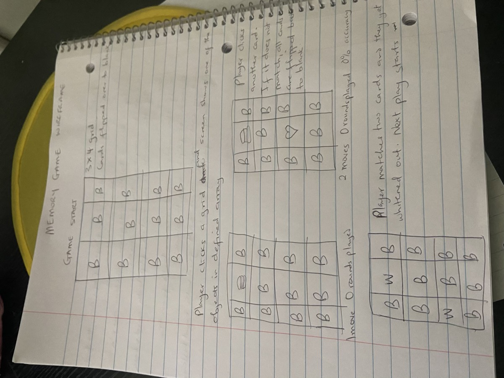
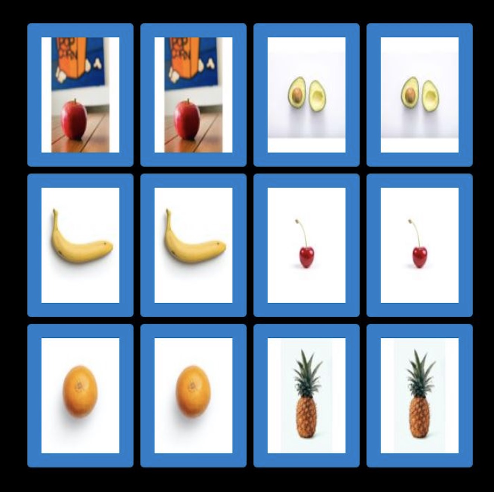

# Memory Game Project
This game is also known as Concentration.\
The goal is to flip over two hidden cards to locate the ones that match.

## Play the Game
- Game can be accessed [here](https://bukkiesho.github.io/Unit1Project/)
## Getting Started
The game is a 3 x 4 grid and cards are randomly placed. There are 6 different parts of card with different images.\
If both cards match after flipping, both cards stay flipped over.\
If there is no match, both cards are flipped back to hidden state.\
Game ends when all cards have been correctly matched.

### Technologies Used
- HTML
- CSS
- JavaScript

### Functions and Objects and Such
addEventListener\
click functionality\
array\
render\
querySelectorAll\
getElementById\
forEach\
innerText and innerHTML\
forEach\
if functions

### Wireframe and Screenshot

### Credit
- [Code with Ana](https://www.youtube.com/watch?v=tjyDOHzKN0w)
- [freeCodeCamp](https://freecodecamp.org)
- [Such a big help](https://github.com/PoBlue/memory-game)

#### Future Learnings
- Plan better
- Code everyday to improve JS functionality skills and make project more interactive